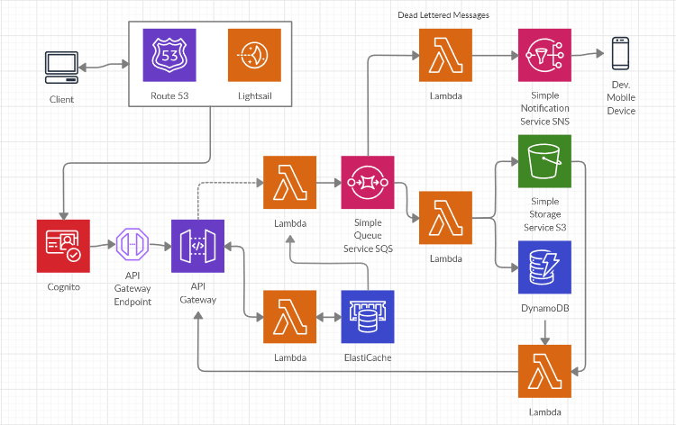
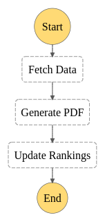

# Basic Cloud Infrastructure[^1]

[^1]: This infrastructure will eventually be modeled and provisioned in an Amazon Cloudformation template for future automation and rapid deployment as well as in the case of a catastrophic system failure.

## Website Infrastructure
#### Amazon Lightsail
The Internship Initiative website consists of a Wordpress site running on an Apache 2.0 server hosted on the Amazon Lightsail service. Wordpress was an ideal starting point for our operations as the support and ease associated with Wordpress allows us to focus on creating a robust backend infrastructure without allocating too many resources to website maintenance. Likewise, Amazon Lightsail provided us with a cost-effective and low maintenance implementation for website hosting. SSL certification is provided for the InternInit.com website through the Let’s Encrypt Organization.
#### Amazon Route 53
DNS services and domain name management is provided through the Amazon Route 53 service. Route 53 was an ideal choice for DNS services as it is already embedded into the AWS infrastructure. This allows us to easily integrate AWS services with an existing DNS infrastructure.

## User Information Processing Infrastructure
#### Introduction
In order to apply for an internship position, users must apply through a form located [here](https://apply.interninit.com). Our application form consists of a custom web app written in React JS. In the past, our form provider was CognitoForms which, while easy to use, was not as customizable as we had hoped. CognitoForms provided us with a GUI to view past form information, however, the data was not easily accessible. This forced us to manually review applicants and match them with prospective businesses. With the new User Information Processing Infrastructure, data is handled in a variety of intermediary steps and finally stored in cloud storage on AWS. This allows us to keep our data ready to easily process with any Amazon service that we require.

#### Amazon API Gateway
My first step in building this infrastructure was transferring data from the form application to AWS. Since the form data is already formatted in JSON, creating an API with a public HTTP endpoint was a logical first step. I created a REST API through Amazon’s API Gateway that forwards HTTP requests onto multiple Lambda functions. The Flask backend serving the ReactJS backend makes HTTP requests to the public API Gateway endpoints in order to facilitate data transfer to and from AWS.

#### Amazon Elasticache
In order to relieve load from the form application, I decided to implement a caching system that stores form data for each user as they progress through the form. The caching system is implemented primarily through the Amazon Elasticache service. My first step in this implementation was provisioning a Redis cluster secured in an Amazon VPC. Whenever a user chooses to apply for an internship, they are issued identity tokens through Amazon Cognito authentication. As the user reaches certain checkpoints in the application process, partial JSON data is collected and POSTed to an API Gateway endpoint. The API Gateway forwards this data to the Lambda function capable of accessing the Redis cluster. Since Redis uses a key/value structure to store data on the cache machine, I decided to form the key through the UUID of the user provided by Cognito and assign the form JSON data as the value. If, for some reason, the user leaves our application form and returns before their session token expires, the form is populated with whatever data is currently cached. When the user decides to submit their final application, the cached data becomes complete and a request is forwarded through the API Gateway to the Lambda function in charge of queuing and subsequently preparing the data for long term storage. Upon transferal of data into long term storage, the user’s cached data is purged from the cache.

#### Amazon Lambda and Amazon Simple Queue Service
When the user submits their application, a request is sent to the API Gateway and the Lambda function responsible for long term storage is called. The function verifies the user's identity and places their UUID into an SQS standard queue. A standard queue was prioritized over a FIFO queue for a multitude of reasons. Firstly, standard queues are available in every service region to all AWS resources. Secondly, message integrity is of higher priority to us than message delivery order. This implementation allows us to decouple the user from the background process by allowing them to upload information even while intensive work such as file uploads are being processed. Additionally, a standard queue prevents loss of data through "at least once delivery" of any message. The primary queue contains a trigger linked to another Lambda function. This trigger activates upon the arrival of a new message in the queue, polls the queue, and sends eligible messages to this Lambda function.

This Lambda function contains the majority of the intensive data processing methods. First, using the UUID mentioned in the queue, the respective user data is pulled from the cache. Then, message integrity is confirmed by ensuring the message structure is complete and appropriate. If, for any reason, the message integrity has been compromised or the Lambda function encounters any sort of error processing the data, the message is not lost. The primary queue is fitted with a redrive policy that is linked to a secondary dead letter (DL) queue. If the message fails to meet specifications for any reason, it is sent to the DL queue for manual review. The DL queue is fitted with its own trigger that is linked to an Amazon SNS topic. Developer's mobile phone numbers are subscribed to the SNS topic and are notified upon the arrival of a message in the DL queue. This notification includes the time of arrival into the DL queue allowing for a simple lookup in CloudWatch logs for the function error [^2].  This robust system with data preservation measures and error handling allows for horizontal scaling in the event that the application process finds itself under heavy traffic.

[^2]: Eventually, an automated system will be developed to deal with messages sent to the DL queue.

#### Amazon DynamoDB
If message integrity is confirmed, it begins its transformation into usable data. First the JSON is parsed through a custom parsing algorithm. Unnecessary information is removed and necessary information is reformatted into a new JSON message. Due to the similarities in structure between JSON artifacts and Document-Based databases as well as the variation in user data structure from user to user, AWS’s DynamoDB stood out as an ideal database structure for storing our information. Since the parsed JSON data is already in the ideal format for DynamoDB, the data is easily stored by performing a simple PutItem query. The DynamoDB primary key is the user's UUID, while the sort key of the database is simply the user’s full name. Due to DynamoDB’s auto-scaling functions, we are able to maximize our utilization based on the volume of user information delivered as well as easily scale upon a sudden influx of user information.

#### Amazon Simple Storage Service (S3)
Since file data is too large to effectively cache, file uploads are handled immediately upon upload as opposed to on submission. Uploading a file to any file upload component in ReactJS will send a request to the API Gateway containing the raw file data. After the user's identity has been confirmed, this file data is written to the user's subfolder in an S3 bucket for long term storage.

#### Retrieving Data From Long Term Storage
Once a user requests that their application be sent to a specific business, steps must be taken to conveniently display necessary intern data. The AWS Step Function service was perfectly suited for this operation as we were able to integrate multiple AWS services together into an easily repeatable procedural workflow. The workflow graph displayed below outline the basic flow user data follows upon the invocation of the state machine. First, user data is pulled from long term storage in S3 and DynamoDB. Then it is passed to a Lambda Function responsible for displaying the data in a PDF file formatted as [such](images/example.pdf). In order to do so, JSON data is inserted into an HTML template which is styled using a Bootstrap stylesheet. This html is converted into a pdf through the use of the [wkhtmltopdf tool](https://wkhtmltopdf.org/). This pdf is stored in the user's subfolder in S3 and. Finally, user data is compared to onboarded business data and students are matched with businesses that match their interests.

# Development Workflow
#### Code Development and Version Control
As most of our backend work is performed on AWS, it made sense to utilize the development tools made available to use through AWS. The majority of coding for backend services are currently either performed directly through the AWS Management Console or, more commonly, through Amazon’s cloud IDE Cloud9. Cloud9 allows for true flexibility with built-in Git compatibility as well as multiple direct AWS service integrations. Our code is stored on a private GitHub repository under the [Internship Initiative Organization](https://github.com/InternInit.
