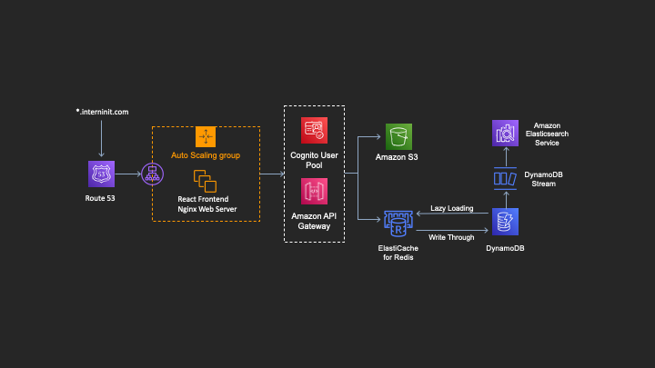

# Basic Cloud Infrastructure[^1]

[^1]: This infrastructure will eventually be modeled and provisioned in an Amazon Cloudformation template for future automation and rapid deployment as well as in the case of a catastrophic system failure.

## Website Infrastructure
#### Amazon Lightsail
The Internship Initiative website consists of a Wordpress site running on an Apache 2.0 server hosted on the Amazon Lightsail service. Wordpress was an ideal starting point for our operations as the support and ease associated with Wordpress allows us to focus on creating a robust backend infrastructure without allocating too many resources to the website maintenance. Likewise, Amazon Lightsail provided us with a cost-effective and low maintenance implementation for website hosting. SSL certification is provided for the InternInit.com website through the Let’s Encrypt Organization.
#### Amazon Route 53
DNS services and domain name management is provided through the Amazon Route 53 service. Route 53 was an ideal choice for DNS services as it is already embedded into the AWS infrastructure. This allows us to easily integrate AWS services with an existing DNS infrastructure.

## User Information Processing Infrastructure
#### Introduction
In order to apply for an internship position, users must apply through a form located [here](https://interninit.com/apply-2). Our form service is provided through a custom web app built in React JS. In the past, our form provider was CognitoForms which, while easy to use, was not as customizable as we had hoped. Cognito Forms provided us with a GUI to view past form information, but the data was not easily accessible. This forced us to manually review applicants and match them with prospective businesses. With the new User Information Processing Infrastructure, data is handled in a variety of intermediary steps and  centralized in a database as well as in cloud storage on AWS. This allows us to keep our data ready to use with any Amazon service that we require.

#### Amazon API Gateway
My first step in building this infrastructure was transferring data from the form application to a custom implementation on AWS. Since form data could be transferred by posting data in JSON format to an HTTP endpoint, creating an API with a public HTTP endpoint was a logical first step. I created a REST API through Amazon’s API Gateway that forwards HTTP requests onto multiple Lambda functions. When a user submits their application on the website, the form data is formatted in JSON and POSTed to the API endpoint.
#### Amazon Elasticache
In order to relieve load from the form application, I decided to implement a caching system that stores form data for each user as they progress through the form. The caching system is implemented primarily through the Amazon Elasticache service. My first step in this implementation was provisioning a Redis cluster secured in an Amazon VPC. Given the choice between a Memcached or a Redis machine, both types of machines easily served our needs, however Redis was chosen due to greater AWS service support. Whenever a user chooses to apply on our website, they are issued a JWT token through Amazon Cognito authentication. Since our web services are all SSL certified, all JWT issuing is done under the cover of HTTPS preventing token interception. As the user reaches certain checkpoints in the application process, partial JSON data is collected and POSTed to an API Gateway endpoint. The API Gateway forwards this data to the Lambda function capable of accessing the Redis cluster. Since the cluster is present in a VPC, this function is the only access point into the cache machine. Since Redis uses key/value organization, the application data is stored as the value while the key is the user’s JWT token. If, for some reason, the user leaves our application form and returns during the lifespan of their JWT token, the form is populated with whatever data is currently cached. When the user decides to submit their final application, the cached data becomes complete and a request is sent to the Lambda function in charge of queuing and subsequently preparing the data for long term storage. Upon transferral of data into long term storage, the user’s cached data is purged from the cache.
#### Amazon Lambda and Amazon Simple Queue Service
When the user submits their form, a request is sent to the API Gateway and the Lambda function responsible for long term storage is called. The function receives the JWT key from the application form through the API Gateway and pulls the data from the Redis cluster. Upon receiving the data, the unaltered data is immediately forwarded onto an SQS standard queue. A standard queue was prioritized over a FIFO queue for a multitude of reasons. Firstly, standard queues are available in every service region to all AWS resources. Secondly, message integrity is of higher priority to us than message delivery order. This implementation allows us to decouple the user from the background process by allowing them to upload information even while intensive work such as file uploads are being processed. Additionally, a standard queue prevents loss of data through "at least once delivery" of any message. The primary queue contains a trigger linked to another Lambda function. This trigger activates upon the arrival of a new message in the queue, polls the queue, and sends eligible messages to this Lambda function.

This Lambda function contains the majority of the intensive data processing methods. First, message integrity is confirmed by ensuring the message structure is complete and appropriate. If, for any reason, the message integrity has been compromised or the Lambda function encounters any sort of error processing the data, the message is not lost. The primary queue is fitted with a redrive policy that is linked to a secondary dead letter (DL) queue. If the message passed to the secondary Lambda function fails to meet specifications for any reason, it is sent to the DL queue for manual review. The DL queue is fitted with its trigger that is linked to an Amazon SNS topic. Developer's mobile phone numbers are subsribed to the SNS topic and are notified upon the arrival of a message in the DL queue. This notification includes the time of arrival into the DL queue allowing for a simple lookup in CloudWatch logs for the function error [^2].  This robust system with data preservation measures and error handling allows for immense horizontal scaling in the event that the application process finds itself under heavy traffic.

[^2]: Eventually, an automated system will be developed to deal with messages sent to the DL queue.

#### Amazon Simple Storage Service (S3)
If the message integrity is confirmed, it begins its transformation into usable data. First the JSON is parsed through a custom parsing algorithm. Unnecessary information is removed and necessary information is reformatted into a new JSON message. Since the user uploads files such as a resume, portfolio, cover letter, etc. Cognito Forms stores these documents on its own servers and includes tokenized links with the outbound JSON message. Since the lifespan on these tokenized messages is typically under half an hour, the documents must be stored in our own infrastructure. After the initial JSON data has been parsed, we perform GET requests to the tokenized URLs and stream the files into an S3 bucket. All user files are stored in one S3 bucket under separate subfolders for each applicant. Upon completion of the file upload process, the parsed JSON data is ready for transfer into a database.

#### Amazon DynamoDB
Due to the similarities in structure between JSON artifacts and Document-Based databases as well as the variation in user data structure from user to user, AWS’s DynamoDB stood out as an ideal database structure for storing our information. Since the parsed JSON data is already in the ideal format for DynamoDB, the data is easily stored by performing a simple PutItem query. The DynamoDB primary key is a unique userID containing the user’s name and an alphanumeric string prefix. The sort key of the database is simply the user’s full name. Due to DynamoDB’s auto-scaling functions, we are able to maximize our utilization based on the volume of user information delivered as well as easily scale upon a sudden influx of user information.

#### Retrieving Data From Long Term Storage
Long term storage of data is provided by Amazon S3 and Amazon DynamoDB. Since both of these services can transfer data as commanded through the Amazon SDK, a Lambda function was perfect for retrieving data from these services. Additionally, this retrieval Lambda function can be called through the API Gateway through a variety of HTTP requests. Eventually this infrastructure will be integrated with a Business portal to allow businesses to peruse prospective interns that have been determined best fits their business.

# Development Workflow
#### Code Development and Version Control
As most of our backend work is performed on AWS, it made sense to utilize the development tools made available to use through AWS. The majority of coding for backend services are currently either performed directly through the AWS Management Console or, more commonly, through Amazon’s cloud IDE Cloud9. Cloud9 allows for true flexibility with built-in Git compatibility as well as multiple direct AWS service integrations such as Lambda. Our code is stored on a private GitHub repository under the [Internship Initiative Organization](https://github.com/InternInit)[^3].

[^3]: We may migrate to AWS CodeCommit however there is currently no need as GitHub satisfies our needs as a team.
